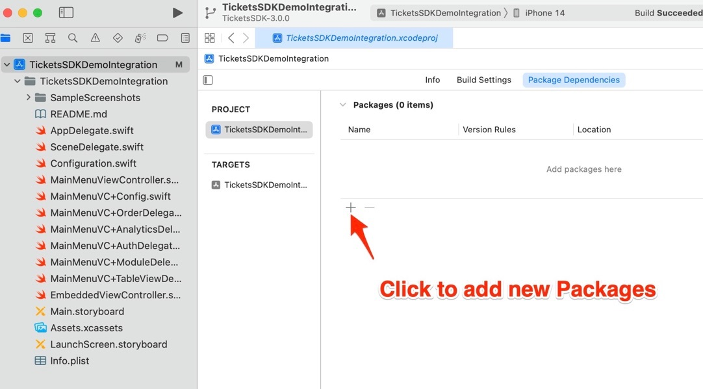
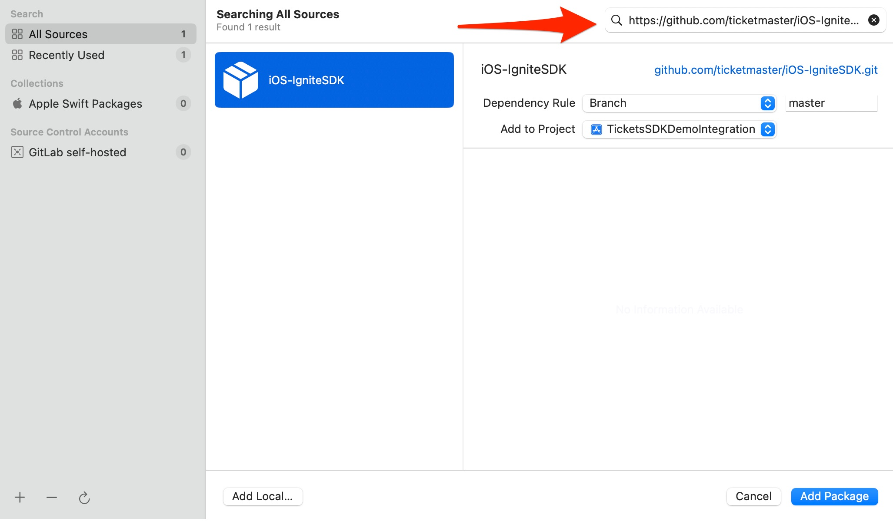
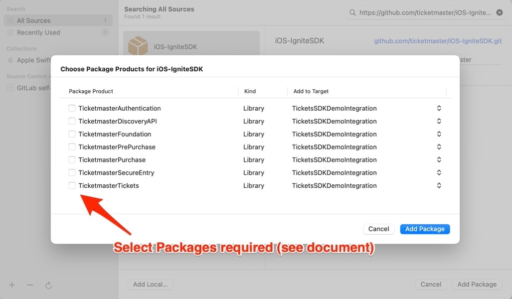
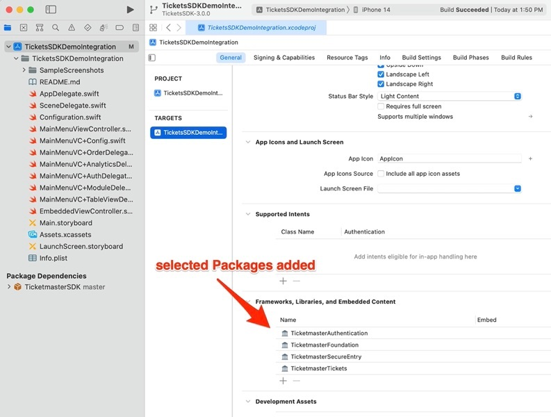

# iOS-IgniteSDK

iOS implementation of Ticketmaster's Ignite SDK

## What is Ignite? 

A collection of mobile frameworks encompassing the User journey of Event Discovery, Purchase, and Entry

* Overview: https://business.ticketmaster.com/ignite/
* Documentation: https://ignite.ticketmaster.com/docs/tickets-sdk-overview
* Frameworks: https://github.com/ticketmaster/iOS-IgniteSDK
* Example Source Code Integration (Tickets only): https://github.com/ticketmaster/iOS-TicketsDemoApp

### Basic Requirements

* Xcode 14.3+ for development
* iOS 14.0+ for deployment

## How do I add these frameworks to my Xcode project?

### Swift Package Manager

1. In your **Xcode** project, go to **Package Dependencies**, then click the **Add** (**+**) button

2. Copy/Paste the URL of this GitHub repo into the Search field
	- https://github.com/ticketmaster/iOS-IgniteSDK.git

3. Select required **Packages** (.xcframework files)

When importing Package Products, you should only add the minimum number of Ticketmaster Libraries required for each feature (see **Packages** section below for requirements).

4. Visually verify that selected Packages were added to your Xcode project

5. For next steps see:
   * Documentation: https://ignite.ticketmaster.com/docs/tickets-sdk-overview
   * Example Source Code Integration: https://github.com/ticketmaster/iOS-TicketsDemoApp

## Packages

### TicketmasterTickets

Purpose: *Post-Purchase and Event Entry (ie. show Purchase Events, Tickets, and Barcodes)*

Required Packages (.xcframeworks):

* TicketmasterAuthentication
* TicketmasterFoundation 
* TicketmasterSecureEntry
* TicketmasterTickets

### TicketmasterPurchase
Purpose: *Event Purchasing*

Required Packages (.xcframeworks):

* TicketmasterAuthentication
* TicketmasterDiscoveryAPI
* TicketmasterFoundation 
* TicketmasterPurchase

### TicketmasterPrePurchase
Purpose: *Webpage-based Event, Attraction, and Venue Discovery*

Required Packages (.xcframeworks):

* TicketmasterAuthentication
* TicketmasterDiscoveryAPI
* TicketmasterFoundation 
* TicketmasterPrePurchase

### TicketmasterDiscoveryAPI
Purpose: *API-based Event, Attraction, and Venue Discovery*

Required Packages (.xcframeworks):

* TicketmasterDiscoveryAPI
* TicketmasterFoundation 
