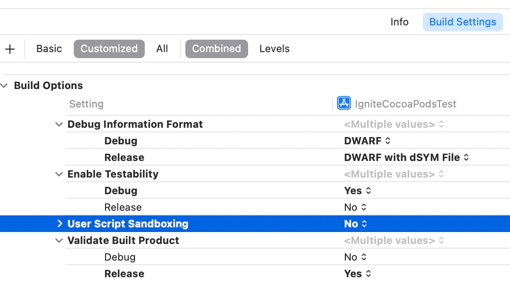

# Ticketmaster Ignite SDK

[](https://cocoapods.org/pods/TM-Ignite)[](https://cocoapods.org/pods/TM-Ignite)

[](https://cocoapods.org/pods/TM-Ignite)[](https://swift.org/package-manager/)

iOS implementation of Ticketmaster's Ignite SDK

## What is Ignite?

A collection of mobile frameworks encompassing the User journey of Event Discovery, Purchase, and Entry.

* Overview: https://business.ticketmaster.com/ignite/
* Release Notes: 
  * Retail: https://ignite.ticketmaster.com/docs/ios-retail-change-log
  * Authentication: https://ignite.ticketmaster.com/docs/ios-authentication-change-log
  * Tickets: https://ignite.ticketmaster.com/docs/ios-tickets-change-log

* Documentation: https://ignite.ticketmaster.com/docs/tickets-sdk-overview
* Frameworks: https://github.com/ticketmaster/iOS-TicketmasterSDK
* Android Source (Tickets SDK): https://github.com/ticketmaster/Android-TicketsDemoApp
* iOS Source (Tickets SDK): https://github.com/ticketmaster/iOS-TicketsDemoApp

### Basic Requirements

* Xcode 15.0.1+ for development
* iOS 15.0+ for deployment

### Change Log

* Tickets SDK: https://ignite.ticketmaster.com/docs/ios-tickets-change-log
* Retail SDK: https://ignite.ticketmaster.com/docs/ios-retail-change-log
* Authentication SDK: https://ignite.ticketmaster.com/docs/ios-authentication-change-log

## Products included in Ignite Package

### [Accounts](https://ignite.ticketmaster.com/docs/accounts-sdk-overview)

Purpose: **Login Management**

Required xcframework libraries:

* TicketmasterFoundation 
* **TicketmasterAuthentication**

### [DiscoveryAPI](https://ignite.ticketmaster.com/docs/discovery-overview)
Purpose: **API-based Event, Attraction, and Venue Discovery**

Required xcframework libraries:

* TicketmasterFoundation 
* **TicketmasterDiscoveryAPI**

### [PrePurchase](https://ignite.ticketmaster.com/docs/pre-purchase-overview)
Purpose: **Webpage-based Event, Attraction, and Venue Discovery**

Required xcframework libraries:

* TicketmasterFoundation 
* TicketmasterAuthentication
* TicketmasterDiscoveryAPI
* **TicketmasterPrePurchase**

### [Purchase](https://ignite.ticketmaster.com/docs/purchase-overview)
Purpose: **Event Ticket Purchasing**

Required xcframework libraries:

* TicketmasterFoundation 
* TicketmasterAuthentication
* TicketmasterDiscoveryAPI
* **TicketmasterPurchase**

### [Tickets](https://ignite.ticketmaster.com/docs/tickets-sdk-overview)

Purpose: **Post-Purchase Ticket Management and Event Entry**

Required xcframework libraries:

* TicketmasterFoundation 
* TicketmasterAuthentication
* **TicketmasterSecureEntry**
* **TicketmasterTickets**

## Installation

### Swift Package Manager

1. In your **Xcode** project, go to **Project**, then **Package Dependencies**, then click the **Add** (**+**) button


2. Copy/Paste the URL of this GitHub repo into the **Search** field
```
https://github.com/ticketmaster/iOS-TicketmasterSDK.git
```

2a. Select **Dependency Rule: Exact Version** of the [latest release version](https://github.com/ticketmaster/iOS-TicketmasterSDK/releases)


3. Select required **Package Products** (.xcframework files), then click **Add Package**

When importing Package Products, you should only add the minimum number of Ticketmaster Libraries required for each feature (see Package Products section below for requirements).


4. Visually verify that the correct xcframework version was added to your project


5. Visually verify that selected Package Products (.xcframework libraries) were added to your Xcode project


6. For next steps see:
   * Documentation: [Tickets SDK Overview](https://ignite.ticketmaster.com/docs/tickets-sdk-overview)
   * Example Source Code Integration: [https://github.com/ticketmaster/iOS-TicketsDemoApp](https://github.com/ticketmaster/iOS-TicketsDemoApp)

### CocoaPods
1. To install CocoaPods:
```ruby
$ sudo gem install cocoapods
````

2. Update your local `Podfile` to the [latest release version](https://github.com/ticketmaster/iOS-TicketmasterSDK/releases):

```ruby
pod 'TM-Ignite', '~> 1.6.0'
```
   * For more information about the `Podfile` see [CocoaPods.org](https://cocoapods.org/)

3. Install TM-Ignite Pod:
```ruby
$ pod install
```

4. CocoaPods requires `User Script Sandboxing = No` in your Xcode Project settings:
   
