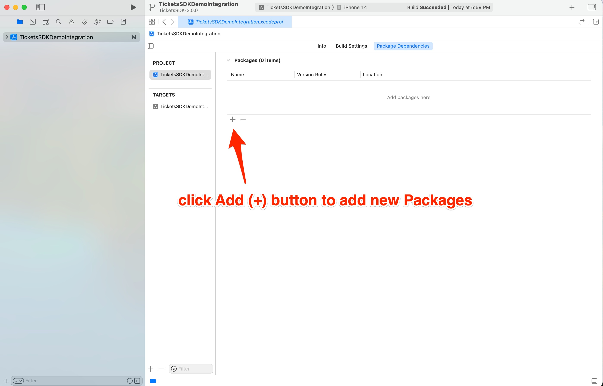
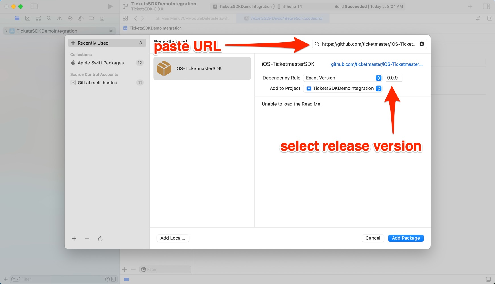
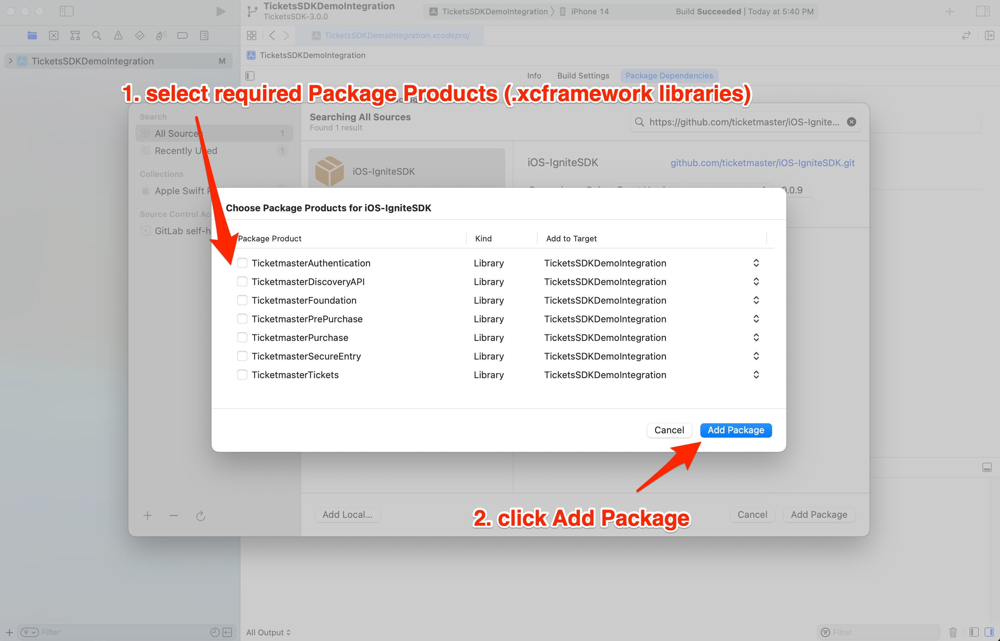
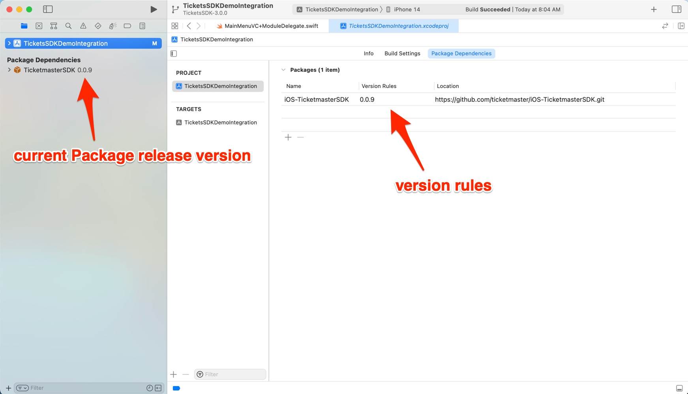
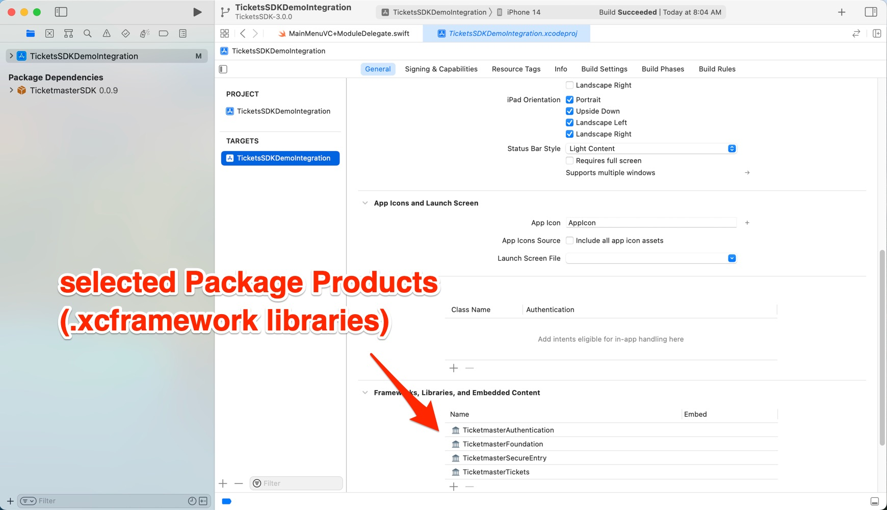

# Ticketmaster Ignite SDK

iOS implementation of Ticketmaster's Ignite SDK

## What is Ignite?

A collection of mobile frameworks encompassing the User journey of Event Discovery, Purchase, and Entry.

* Overview: https://business.ticketmaster.com/ignite/
* Documentation: https://ignite.ticketmaster.com/docs/tickets-sdk-overview
* Frameworks: https://github.com/ticketmaster/iOS-TicketmasterSDK
* Android Source (Tickets SDK): https://github.com/ticketmaster/Android-TicketsDemoApp
* iOS Source (Tickets SDK): https://github.com/ticketmaster/iOS-TicketsDemoApp

### Basic Requirements

* Xcode 14.3+ for development
* iOS 14.0+ for deployment

## How do I add these frameworks to my Xcode project?

### Swift Package Manager

1. In your **Xcode** project, go to **Project**, then **Package Dependencies**, then click the **Add** (**+**) button



2. Copy/Paste the URL of this GitHub repo into the **Search** field
```
https://github.com/ticketmaster/iOS-TicketmasterSDK.git
```

2a. Select **Dependency Rule: Exact Version** of the [latest release version](https://github.com/ticketmaster/iOS-TicketmasterSDK/releases)



3. Select required **Package Products** (.xcframework files), then click **Add Package**

When importing Package Products, you should only add the minimum number of Ticketmaster Libraries required for each feature (see Package Products section below for requirements).



4. Visually verify that the correct SDK version was added to your project



5. Visually verify that selected Package Products (.xcframework libraries) were added to your Xcode project



6. For next steps see:
   * Documentation: [Tickets SDK Overview](https://ignite.ticketmaster.com/docs/tickets-sdk-overview)
   * Example Source Code Integration: [https://github.com/ticketmaster/iOS-TicketsDemoApp](https://github.com/ticketmaster/iOS-TicketsDemoApp)

## Package Products

## TicketmasterTickets

Purpose: *Post-Purchase and Event Entry (ie. show Purchase Events, Tickets, and Barcodes)*

Required Package Products (.xcframework libraries):

* TicketmasterAuthentication
* TicketmasterFoundation 
* TicketmasterSecureEntry
* TicketmasterTickets

## TicketmasterPurchase
Purpose: *Event Purchasing*

Required Package Products (.xcframework libraries):

* TicketmasterAuthentication
* TicketmasterDiscoveryAPI
* TicketmasterFoundation 
* TicketmasterPurchase

## TicketmasterPrePurchase
Purpose: *Webpage-based Event, Attraction, and Venue Discovery*

Required Package Products (.xcframework libraries):

* TicketmasterAuthentication
* TicketmasterDiscoveryAPI
* TicketmasterFoundation 
* TicketmasterPrePurchase

## TicketmasterDiscoveryAPI
Purpose: *API-based Event, Attraction, and Venue Discovery*

Required Package Products (.xcframework libraries):

* TicketmasterDiscoveryAPI
* TicketmasterFoundation 
